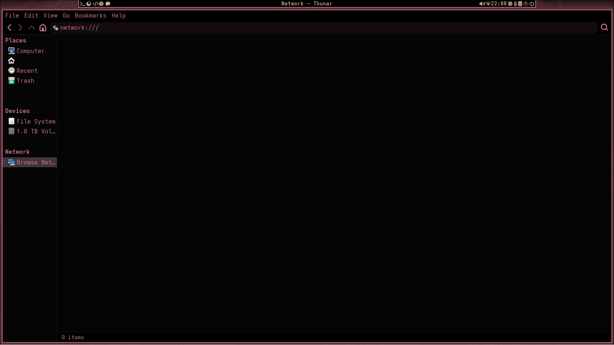

<div align="center">

<br>
<a href="mailto:ascaniolamp@gmail.com">
	
</a>
<a href="./LICENSE">
	
</a>


<br>
<a href="https://liberapay.com/Ascaniolamp/donate">

</a>
<a href="https://paypal.me/AscanioNarcisi">

</a>
</a>
<a href="https://paypal.com/donate/?hosted_button_id=EED5LRPSLVP4Q">

</a>
<br><br>
A complete Hyprland rice for Arch Linux inspired by Serial Experiments Lain.
<br>
<sup>* Most themes and configurations are compatible with non-hyprland installations.</sup>
<br>
<hr>
<a href=".#Notes"><kbd> <br> Notes <br> </kbd></a> 
<a href=".#Install"><kbd> <br> Install <br> </kbd></a> 
<a href=".#Content"><kbd> <br> Content <br> </kbd></a> 
<a href=".#Credits"><kbd> <br> Credits <br> </kbd></a> 
<hr>





</div>

## <div align="center" id="Disclaimer">‼️ 🚨 ⚠️ DISCLAIMER ⚠️ 🚨 ‼️</div>
This started off and was supposed to be my personal rice.
When I'd finished working on it, I thought others may like it,
so I decided to share it to the public.
That's why I was careless about tracking any credits or sources
(a bona fide mistake which I should've made up to AFAIK).
If you're planning on forking this repository or doing any modifications of your own,
please do read the ["License" disclaimer](.#License)
for your and for the original authors' sake.

Because of the same reason, **nothing** in this project is made to be professional nor elegant.
I highly reccomend you either check (and maybe even modify) the installation
scripts or just avoid them completely, as they could possibly be destructive
in regards to your old configuration files.
Only use the `--no-preserve` option if you know what you're doing
and have already backed up your previous configuration files.
If any problems arise after running the scripts, replace the new configuration
files with the old, backed up ones (ending in `.hyprlainbak`).
By reviewing the scripts, you'll easily find the directories that are utilized,
so that you can manually install the configuration files yourself.
With this being said, if you're on a freshly-installed system, they shouldn't
be destructive (as you might not have many dotfiles yet).

## <div align="center" id="Notes"> ❗ Important Notes ❗ </div>
- Various repositories are included in the installation scripts.
	If you wish to review them, they're listed in each submodule's `aurpkgs.lst` and `pacpkgs.lst` files
	(some may have more listed in their READMEs).
- Most submodules will require the [Adwaita Mono Nerd Font](https://github.com/nazmulidris/adwaita-mono-nerd-font) to be installed.
- When applying a theme in nwg-look (by clicking the GUI "apply" button),
	the .config/assets folder will automatically be deleted.
	This is because of nwg-look, it doesn't have anything to do with me!

## <div align="center" id="Install"> 📥 🖥️ Install 🖥️ 📥 </div>
Hyprlain was configured and tested on a machine running **Hyprland** on **Arch Linux**,
so I can guarantee you it'll work on such an installation.
If it doesn't, [open an issue](https://github.com/Ascaniolamp/Hyprlain/issues)
after checking you followed all the installation instructions correctly.

The configurations should, AFAIK, work regardless of what distro you're running.
All of them have been specifically configured with wayland in mind,
so if you're trying to install them on an X11 DE, you might want to check their options.

- **Arch Linux**: You can either [run the installation scripts](.#Scripts) or follow the [manual installation](.#Manual).
- **Other distros**: Only [manual installation](.#Manual) is currently supported.

### Scripts
<div align="center">
<strong>⚠️ <a href="https://github.com/Jguer/yay#installation">YAY</a> IS USED TO INSTALL AUR PACKAGES VIA THE INSTALL SCRIPTS ⚠️</strong><br>
<strong><sup>IF YOU'D RATHER USE ANOTHER AUR HELPER, YOU'RE GOING TO HAVE TO MODIFY THE HELPER SCRIPT</sup></strong>
</div>

If you don't want to run the `install.sh` script manually, on an **Arch Linux** install with the **Hyprland** profile selected during `archinstall`, paste and run this into your terminal to run an all-in-one command:
```sh
sudo pacman -Syu --needed git && git clone https://github.com/Ascaniolamp/Hyprlain.git && cd Hyprlain/src && ./install.sh
```

If you only want to download a single theme or configuration,
each submodule's folder should contain its individual `install.sh` script,
which will require you download and put the `helper.sh` script in its parent directory to work.
This is what the directory tree should look like:
```
PARENT
	├── helper.sh
	└── hyprland
		├── install.sh
		└── src
```

### Manual
You could try modifying the `helper.sh` script's `downdependencies` function
to fit your distro's package manager.
I actually encourage you do so and share the modified script,
as it may come in handy to other people.
<sup>It's a really quick and easy fix that anyone with some basic bash knowledge can do.</sup>
<sup>I could do it myself, but I don't feel the necessity to do so right now.</sup>

Otherwise, each `install.sh` script indicates the installation process:

1. Install the [Adwaita Mono Nerd Font](https://github.com/nazmulidris/adwaita-mono-nerd-font).
2. Check the install script of every module you want to download for instructions:
	1. Download the packages listed in `pacpkgs.lst` and `aurpkgs.lst`
	2. The `substitute` function's first argument contains the path in which the second argument file should go.
		Substitute these files manually (with the right precautions).
3. Restart your device (optional, but the changes won't have any effect until you do).

This isn't a super in-depth guide made for beginners,
I count on your bash knowledge and my code's readability and simplicity.
This is the case for `sh` commands (which will require you to execute them)
or lines which will require you to modify the content of the treated files.

For now, [y]our only hope is that somebody else (with the right time and knowledge) will come along and contribute to this project.
If you think you could be that person, please do so!

## <div align="center" id="Content"> 💾 📜 Content (Submodules) 📜 💾</div>

<div align="center">
* The marked submodules aren't included in the main installation script.
<br><br>
<a href="./src/hyprland"><kbd> <br> Hyprland <br> </kbd></a> 
<a href="./src/sddm"><kbd> <br> SDDM <br> </kbd></a> 
<a href="./src/rofi"><kbd> <br> Rofi <br> </kbd></a> 
<a href="./src/spotify"><kbd> <br> Spotify <br> </kbd></a> 
<a href="./src/vesktop"><kbd> <br> Vesktop <br> </kbd></a> 
<br>
<a href="./src/gtkqtxdg"><kbd> <br> GTK & QT <br> </kbd></a> 
<a href="./src/dotfiles#Audacious"><kbd> <br> *Audacious <br> </kbd></a> 
<a href="./src/dotfiles#Firefox"><kbd> <br> Firefox <br> </kbd></a> 
<a href="./src/albert"><kbd> <br> Albert <br> </kbd></a> 
<a href="./src/dotfiles"><kbd> <br> More <br> </kbd></a> 
</div>

## <div align="center" id="Credits"> 🎀 🌐 ♥ Credits ♥ 🌐 🎀 </div>

Most credits are inside every submodule's README.
I'm currently looking for all due credits.
If you think you should be on [this](./.github/ACKNOWLEDGMENTS.md) list,
[contact me](mailto:ascaniolamp@gmail.com)!

<strong align="center" id="fauux">Fauux</strong>
<br>
Most (if not all) of the amazing graphics come from fauux's [neocities page](https://fauux.neocities.org).
If you're able to do so, please [send them a donation](https://paypal.com/donate/?hosted_button_id=EED5LRPSLVP4Q),
they really deserve it!
Also, go check out their [other project](https://thaer.no)
and their [youtube channel](https://youtube.com/@fauux) if you're interested.
They own basically all the art that was used inside this project.

## License
<div align="center">
<strong>⚠️ I DO NOT OWN ANY RIGHTS TO THE GRAPHICS AND SOUNDS USED IN THIS PROJECT ⚠️</strong><br>
<strong>THEY'RE THE PROPERTY OF THEIR CORRESPONDING OWNERS</strong><br>
<strong><sup>THEREFORE, THEY AREN'T DISTRIBUTED UNDER ANY OF MY LICENSES</sup></strong>
<br>
<sub>
This is a fanmade project inspired by Serial Experiments Lain.
All characters, images, logos, and stylistic elements from Serial Experiments Lain
are the intellectual property of Yasuyuki Ueda, Yoshitoshi ABe, Triangle Staff, and/or their respective rights holders.
This project is not affiliated with, endorsed by, or sponsored by the original creators or rights holders.
All trademarks and copyrights remain the property of their respective owners.
This customization is shared for non-commercial, educational, and entertainment purposes under fair use.
If you are a rights holder and wish for content to be removed or altered, please <a href="mailto:ascaniolamp@gmail.com">contact the developer</a>.
</sub>
</div>
<br>

This project and most of its submodules are licensed under the [GPLv3.0 license](./LICENSE).
Submodules with different `LICENSE` files are licensed accordingly (e.g. vesktop, spotify).
You can read more about how to help in the [contributing guide](./.github/CONTRIBUTING.md).

© [The authors and contributors](./.github/AUTHORS.md)

## TODO
- Symlink install as default option
- Performance mode (remove all processing-heavy styling from hyprland config)
